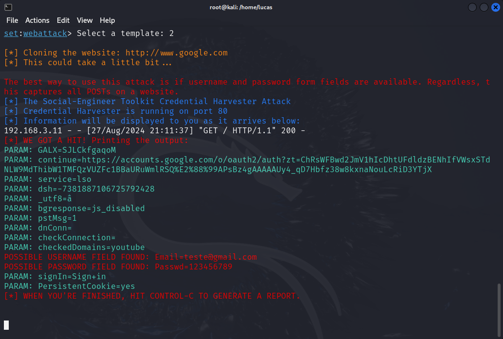

# Repositório destinado a fins de estudo do Kali Linux

Neste repositório estará os passos que foram tomados para realizar a criação de um Phishing usando o Kali Linux.

1. Primeiro passo é executar a ferramenta Social-Engineer Toolkit
2. Em seguida, será apresentado um menu, onde será selecionado a opção `1) Social-Engineering Attacks`
3. Nessa etapa podemos escolher o tipo de ataque que iremos construir, optando pela opção `2) Website Attack Vectors`
4. Agora, podemos escolher entre diferentes tipos de métodos de ataque baseados em websites, aqui eu escolhi a opção `3) Credential Harvester Attack Method`, para realizar a coleta de credenciais.
5. A ferramenta nos fornece Templates prontos ou pede para clonar um site, eu opto por utilizar um template pronto, depois de selecionar a opção, ele pede um endereço de IP para hospedar a aplicação e basta selecionar a opção do Google.

Feito isso o Toolkit irá gerar para nós um servidor rodando a aplicação no endereço IP fornecido, monitorando todos os eventos que ocorrerem na página.

